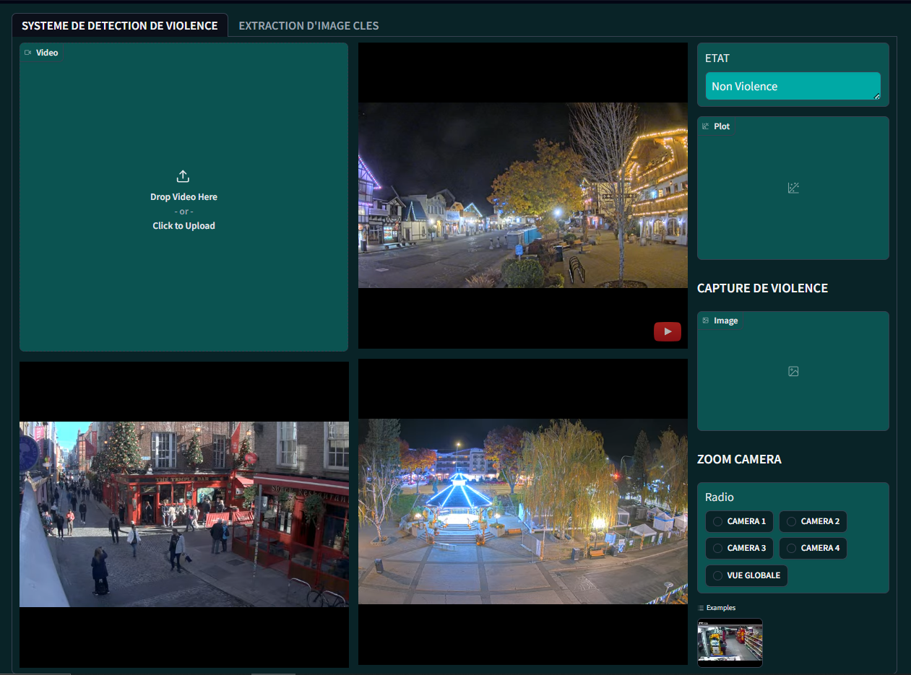
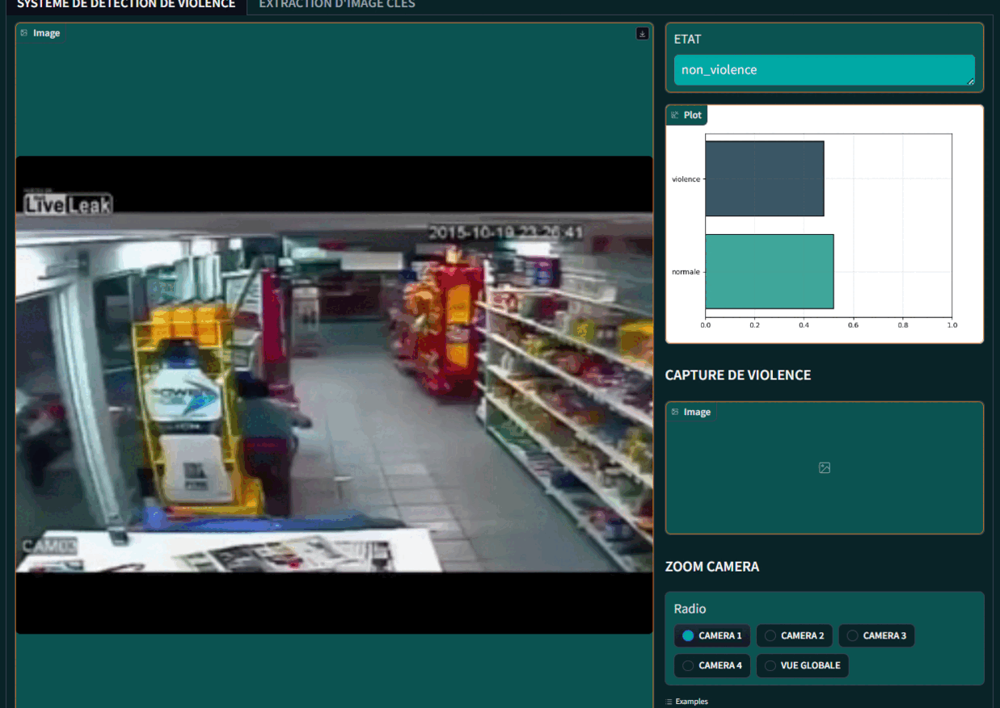
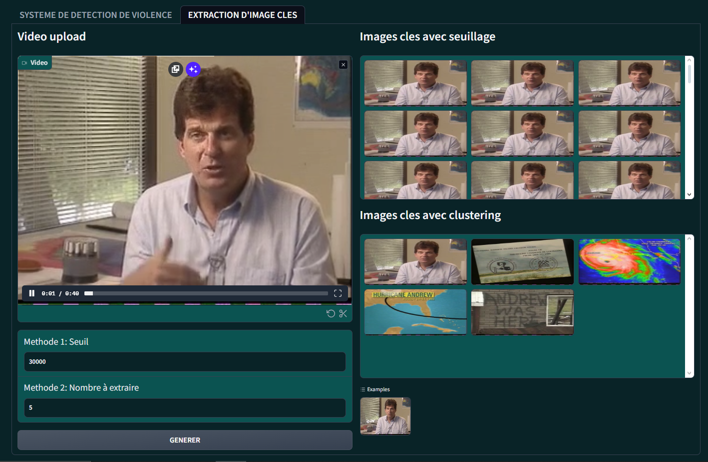

# Real-Time Violence Detection System 🚨

 Monitoring surveillance videos for violence is challenging due to the sheer volume of footage. Automating this task reduces errors and saves resources and even lives. After exploring and developping deep learning models for this task, we used the best model developped with 90% accuracy on the challenging UFC-Crime dataset after being trained on the RWF2000 dataset.


## Installation 🛠️

```bash
  pip install -r requirements.txt
```

then run the file ```interface.ipynb```
## Usage/Examples 


The user interface developed in this project was designed to demonstrate the real-world applicability of our system. We recreated the core software typically used by surveillance agents to navigate through cameras and monitor them. Then, we enhanced it with our real-time automatic violence detection system and displayed additional information that is constantly updated.

 The interface includes live video streams from multiple cameras, real-time violence detection, and camera zoom selection.

<p align="center">
  
</p>

The system updates detection status in real-time, triggers an alarm, and saves a screenshot if violence is detected.



Keyframe extraction is indeed a preprocessing step in violence detection, but its application goes beyond the scope of this project, as it serves as a standalone tool for video summarization. That’s why we highlighted it by dedicating a separate interface to it. By clicking on the second tab of our application, users can access this feature.
 Users can upload videos, set keyframe extraction parameters, and generate keyframes automatically or manually using two methods.

 <p align="center">
  
</p>


## License 📜

[creativecommons](https://creativecommons.org/licenses/by-nc-sa/4.0/)
